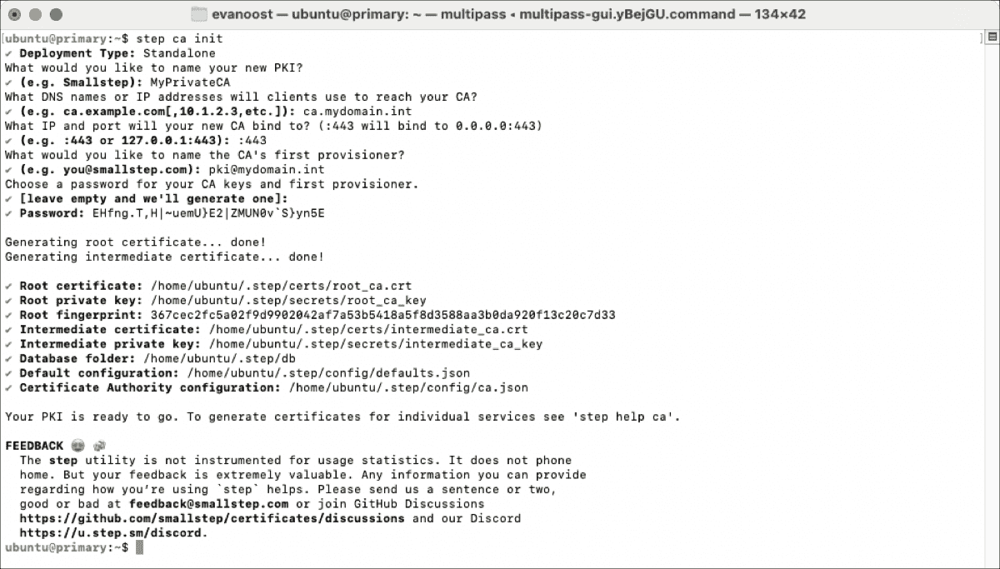

Step-ca инструмент управления центром сертификации (CA)

Возможности Step-ca:
* Выпуск X.509 HTTPS-сертификатов для работы в браузерах.
* Выпуск X.509 клиентских сертификатов для включения взаимной аутентификации TLS (mTLS).
* Выпуск SSH-сертификатов для пользователей при использовании единого идентификатора для входа (SSO ID tokens).
* Выпуск SSH-сертификатов для хостов в обмен на идентификаторы облачных экземпляров.
* Автоматизация управления сертификатами с помощью ACME v2.
* Выдача краткосрочных сертификатов с автоматической регистрацией, обновлением и отзывом.
* Обеспечение высокой доступности с использованием корневой федерации и/или нескольких промежуточных CA.
* Работа в качестве промежуточного CA в сети для существующего корневого CA.
* Выпуск токенов единого входа OAuth OIDC (Okta, GSuite, Azure AD, Auth0, Keycloak или Dex).
* Идентификация облачных экземпляров для виртуальных машин на AWS, GCP и Azure.
* Выдача одноразовых краткосрочных токенов JWK вашим инструментам непрерывной поставки (CD) — Puppet, Chef, Ansible, Terraform и др.
* Выполнение запроса на вызов SCEP (SCEP provisioner).
* Обновление сертификатов хостов SSH (SSHPOP provisioner).

В этой статье вы ознакомитесь с процессом установки и настройки step-ca в Linux. Мы разрешим step-ca использовать протокол ACME, чтобы ваши системы могли автоматически запрашивать и обновлять сертификаты.

**Установка step-ca**

В этом руководстве я использую Ubuntu Linux 22.04 LTS. Step-ca является кроссплатформенным. Инструкции по установке доступны для всех основных операционных систем и различных дистрибутивов Linux. Я установлю систему на выделенную виртуальную машину с ca.mydomain.int именем хоста. При предоставлении сертификатов TLS для внутренних доменов требуется функциональная инфраструктура DNS. Сертификаты создаются для DNS-имен хоста, которые ACME использует для проверки клиента. Вам придется адаптировать эти инструкции, чтобы они соответствовали вашей собственной структуре DNS.

Мы обновим все до последней версии, загрузим пакет с помощью wget и установим сервер step-ca.

```shell
wget https://github.com/smallstep/certificates/releases/download/v0.25.2/step-ca_0.25.2_amd64.deb
sudo dpkg -i step-ca_0.25.2_amd64.deb
```

Это приведет к установке двоичного файла step-ca в /usr/bin/step-ca и необходимо только для серверной части. Клиентам этот пакет не понадобится. Кроме того, мы установим Step CLI на сервер, чтобы разрешить настройку сервера.
```shell
wget https://github.com/smallstep/cli/releases/download/v0.25.2/step-cli_0.25.2_amd64.deb
sudo dpkg -i step-cli_0.25.2_amd64.deb
```
Step-cli упрощает управление и проверку публикуемого вами центра сертификации.

**Инициализация step-ca**

С помощью приведенной ниже команды мы инициализируем центр сертификации с помощью Step CLI:

```shell
step ca init
```

Если вы заменяете или дополняете существующую PKI (инфраструктуру открытых ключей), вы можете передать существующий корневой сертификат и закрытый ключ. Также доступны дополнительные опции для облачной инфраструктуры (например, системы управления ключами Amazon или Azure).

В этом руководстве я буду настраивать центр сертификации со следующими настройками:

* **Deployment Type**: `Standalone` - Автономные облачные сервисы и средства мониторинга доступны, но могут потребовать дополнительных затрат при более масштабном развертывании.
* **PKI Name**: `MyPrivateCA` – Для более крупных развертываний вам следует сделать это название описательным, чтобы различать тестовую среду, среду разработки и производственную среду.
* **DNS names or IP addresses**: `ca.mydomain.int` – Эти DNS-имена и IP-адреса будут включены в сертификат CA. Добавьте здесь свои собственные DNS-имена и IP-адреса.
* **IP and port to bind to** `:443` – Это приведет к привязке ко всем IP-адресам на порту 443. Если вы прокси-сервер приложения используете Nginx или балансировщик нагрузки, вы можете привязаться к внутреннему IP 127.0.0.1 и/или использовать другой порт.
* **First provisioner**: `pki@mydomain.int` – Это эквивалент суперпользователя или пользователя root сервера PKI. mydomain.int построен на моей личной инфраструктуре DNS. Пожалуйста, настройте его в соответствии с вашими требованиями.
* **Password**: Оставьте пустым – это автоматически сгенерирует пароль, который вы должны сохранить.



Впоследствии мы убедимся, что можем запустить сервер step-ca от имени обычного пользователя (не от имени root) и запустить сервер:

```shell
sudo setcap CAP_NET_BIND_SERVICE=+eip $(which step-ca)
step-ca
```
При этом будет запрошен случайный пароль, который мы сгенерировали выше, чтобы разблокировать корневые ключи. Должно получиться что-то вроде этого:

```shell
2023/12/19 09:25:44 Starting Smallstep CA/0.25.2 (linux/arm64)
…
2023/12/19 09:25:44 X.509 Root Fingerprint: …
2023/12/19 09:25:44 Serving HTTPS on :443 ...
```

Теперь запущен ваш центр сертификации.

Если вы не получаете последнюю строку, что-то мешает вам обслуживать это приложение на порту 443. Нажмите CTRL+C, чтобы выйти из программы и прочитать, почему не удалось выполнить привязку, из сообщений журнала, которые на данный момент должны быть выведены на вывод терминала. Если вы используете Linux, обычным пользователям, как правило, не разрешается работать с портами ниже 1024. Чтобы решить проблему, вы можете либо использовать команду setcap, либо запустить приложение от имени root с помощью sudo, либо поместить его в контейнер в Docker.

Иногда у вас может быть веб-сервер, уже запущенный на этом порту. Если SELinux включен, вы должны разрешить приложению step-ca запускаться на привилегированном порту. Во время установки или в файле конфигурации укажите альтернативный порт (например, 8443) и используйте существующую конфигурацию веб-сервера в качестве прокси.

Если все в порядке, теперь у вас есть работающая система PKI! Для запуска центра сертификации потребуется ваш пароль для расшифровки сертификата. Лучше всего хранить пароль в безопасном месте, таком как хранилище или чип TPM. Скомпрометированный корневой ключ может привести к компрометации всей вашей PKI.

**Автоматический запуск вашего PKI при перезагрузке вашей системы:**

На данный момент у нас есть служба, работающая на порту 443. Однако мы не хотим делать это вручную при каждой перезагрузке сервера. Нажмите CTRL+C в терминале, где вы запустили процесс, чтобы завершить процесс step-ca. Мы хотим запускать подобные службы под учетной записью службы с ограниченным доступом:

```shell
sudo useradd --system --home /etc/step-ca --shell /bin/false step
```

Создайте и переместите конфигурацию вашего центра сертификации в домашний каталог пользователя step:

```shell
sudo mkdir /etc/step-ca
sudo mv $(step path)/* /etc/step-ca
```
В директории /etc/step-ca будет такая структура
```shell
certs  config  db  secrets  templates
```

Введите свой пароль PKI в `/etc/step-ca/password.txt`, чтобы его можно было прочитать при запуске сервера. Обратите внимание, что вам придется редактировать эти файлы от имени root, поэтому убедитесь, что вы указали sudo vi или sudo nano для редактирования этих файлов. В идеале этот ключ должен храниться в TPM2, YubiKey или другой защищенной системе. Однако это выходит за рамки данного руководства.

Теперь отредактируйте файл `/etc/step-ca/config/defaults.json` и `/etc/step-ca/config/ca.json`, чтобы отразить новый путь. В моем случае мне пришлось изменить различные ключи в конфигурации с `/home/ubuntu/.step` на `/etc/step-ca`, что лучше всего работает с использованием функций поиска и замены в вашем редакторе.

Установите пользователя step владельцем каталога конфигурации вашего CA:

```shell
sudo chown -R step:step /etc/step-ca
```

Создайте файл модуля systemd в вашем любимом редакторе. Еще раз, вы можете использовать vi или nano:

```shell
sudo nano /etc/systemd/system/step-ca.service
```
Добавьте следующее содержимое:

```shell
[Unit]
Description=step-ca service
Documentation=https://smallstep.com/docs/step-ca
Documentation=https://smallstep.com/docs/step-ca/certificate-authority-server-production
After=network-online.target
Wants=network-online.target
StartLimitIntervalSec=30
StartLimitBurst=3
ConditionFileNotEmpty=/etc/step-ca/config/ca.json
ConditionFileNotEmpty=/etc/step-ca/password.txt
[Service]
Type=simple
User=step
Group=step
Environment=STEPPATH=/etc/step-ca
WorkingDirectory=/etc/step-ca
ExecStart=/usr/bin/step-ca config/ca.json --password-file password.txt
ExecReload=/bin/kill --signal HUP $MAINPID
Restart=on-failure
RestartSec=5
TimeoutStopSec=30
StartLimitInterval=30
StartLimitBurst=3
; Process capabilities & privileges
AmbientCapabilities=CAP_NET_BIND_SERVICE
CapabilityBoundingSet=CAP_NET_BIND_SERVICE
SecureBits=keep-caps
NoNewPrivileges=yes
; Sandboxing
ProtectSystem=full
ProtectHome=true
RestrictNamespaces=true
RestrictAddressFamilies=AF_UNIX AF_INET AF_INET6
PrivateTmp=true
PrivateDevices=true
ProtectClock=true
ProtectControlGroups=true
ProtectKernelTunables=true
ProtectKernelLogs=true
ProtectKernelModules=true
LockPersonality=true
RestrictSUIDSGID=true
RemoveIPC=true
RestrictRealtime=true
SystemCallFilter=@system-service
SystemCallArchitectures=native
MemoryDenyWriteExecute=true
ReadWriteDirectories=/etc/step-ca/db
[Install]
WantedBy=multi-user.target
```

Этот файл также размещен на [GitHub](https://github.com/smallstep/certificates/blob/master/systemd/step-ca.service).

Вот несколько примечаний о свойствах в этом файле, созданных для изолирования приложения:

* Пользователь и группа заставляют step-ca запускаться от имени пользователя службы, которого мы создали ранее.
* Использование AmbientCapabilities и CapabilityBoundingSet предназначено для ограничения диапазона возможностей, которые может получить процесс. В этом случае мы можем привязываться только к портам, которые меньше 1024, как обсуждалось ранее.
* SecureBits позволяет службе сохранять свои возможности даже после переключения на пользователя step. NoNewPrivileges гарантирует, что после запуска процесса он не сможет повысить свой уровень для получения новых привилегий.
* ProtectSystem, ProtectHome и RestrictNamespaces изолируют процесс.
* RestrictAddressFamilies не позволяет службе выделять сокеты, отличные от IP или Unix.
* PrivateTmp и PrivateDevices предоставляют службе закрытый каталог временных файлов и доступ к закрытому набору ключевых псевдоустройств (например, генератору случайных чисел), но не имеют доступа к реальному оборудованию.
* Строфы Protect* ограничивают доступ к системным ресурсам, поэтому процесс не может их изменять.
* Блокировка личности гарантирует, что процесс не сможет сменить личность после запуска. Это включает в себя отключение поддержки ASMR и возможностей виртуальной памяти или переключение с 64-разрядного на 32-разрядный режим, что может указывать на компромисс.
* RestrictSUIDSGID ограничивает создание файлов setuid/setgid (файлы, запускаемые от имени root).
* RemoveIPC удаляет все объекты межпроцессного взаимодействия, которые служба создает при остановке.
* RestrictRealtime ограничивает доступ к планированию в реальном времени.
* SystemCallFilter и SystemCallArchitectures определяют список системных вызовов, которые может использовать служба.
* MemoryDenyWriteExecute предотвращает создание службой сопоставлений памяти, доступных для записи и исполняемых файлов.
* ReadWriteDirectories гарантирует, что процесс может выполнять запись в свой каталог состояния.

Теперь нам нужно убедиться, что система распознает изменение, затем включить и запустить процесс step-ca, это также позволит ему запуститься при загрузке вашей системы Linux:

```shell
sudo systemctl daemon-reload
sudo systemctl enable --now step-ca
sudo systemctl status step-ca
```

Команда status должна возвращать значение Active: активный (запущен) и часть выходных данных процесса step-ca. Если произошла ошибка или вы хотите просмотреть журналы, вы можете использовать следующую команду:

```shell
sudo journalctl -u step-ca
```

Отныне, если вы хотите настроить свой сервер step-ca в этом новом расположении, обязательно укажите путь к конфигурации в качестве переменной окружения:

```shell
export STEPPATH=/etc/step-ca
```
Теперь вы можете убедиться, что он находится в папке /etc/step-ca:

```shell
sudo step certificate fingerprint $(step path)/certs/root_ca.crt
```

Устанавливаем docker
```shell
sudo apt install docker.io docker-compose-v2 
```

Добавляем текущего юзера в группу docker
```shell
sudo usermod -aG docker $USER
```

Создаем директорию /etc/docker-compose

```shell
sudo mkdir -p /etc/docker-compose
sudo chown -R ubuntu:ubuntu /etc/docker-compose
```

Запускаем FreeIPA для генерации CSR в /etc/docker-compose/docker-compose.yaml
```yaml
version: "3.8"

services:
  freeipa:
    image: freeipa/freeipa-server:fedora-39-4.11.1
    container_name: freeipa
    restart: unless-stopped
    hostname: freeipa.mydomain.int
    ports:
      - 123:123/udp
      - 389:389
      - 8443:443
      - 464:464
      - 464:464/udp
      - 636:636
      - 80:80
      - 88:88
      - 88:88/udp
    tty: true
    stdin_open: true
    environment:
      IPA_SERVER_HOSTNAME: freeipa.mydomain.int
      TZ: "Europe/Moscow"
    command:
      - --no-ntp
      - --no-host-dns
      - --admin-password=youpassword
      - --dirsrv-pin=youpassword
      - --ds-password=youpassword
      - --external-ca
      - --http-pin=youpassword
      - --realm=freeipa.mydomain.int
      - --unattended
    cap_add:
      - SYS_TIME
      - NET_ADMIN
    volumes:
      - /etc/docker-compose/ca:/ca
      - /etc/docker-compose/freeipa-certificate:/freeipa-certificate
      - /etc/docker-compose/freeipa-data:/data
      - /etc/localtime:/etc/localtime:ro
      - /sys/fs/cgroup:/sys/fs/cgroup:ro
    sysctls:
      - net.ipv6.conf.all.disable_ipv6=0
      - net.ipv6.conf.lo.disable_ipv6=0
    security_opt:
      - "seccomp:unconfined"
    tmpfs:
    - /run
    - /tmp
```

## CSR FreeIPA
CSR FreeIPA берем по пути /etc/docker-compose/freeipa-data/ipa.csr

Просмотр CSR
```shell
openssl req -text -noout -verify -in /etc/docker-compose/freeipa-data/ipa.csr
```

Прописываем `ca.mydomain.int` либо в DNS либо в /etc/hosts

# Подпишем зашифрованный запрос на выпуск сертификата (csr) FreeIPA корневым сертификатом CA, так как в FreeIPA csr указано поле `CA:True` и только корневой сертификат может его подписать. Потребуем пароль из файла /etc/step-ca/password.txt
```shell
sudo step certificate sign --profile intermediate-ca /etc/docker-compose/freeipa-data/ipa.csr /etc/step-ca/certs/root_ca.crt /etc/step-ca/secrets/root_ca_key > /etc/docker-compose/freeipa-data/ipa.crt
```

Просмотр CRT
```shell
openssl x509 -noout -text -in /etc/docker-compose/freeipa-data/ipa.crt
```

Копируем root CA  сертификат в FreeIPA:
```shell
sudo cp /etc/step-ca/certs/root_ca.crt /etc/docker-compose/ca/root_ca.crt
```

Обновляем /etc/docker-compose/docker-compose.yaml
```yaml
version: "3.8"

services:
  freeipa:
    image: freeipa/freeipa-server:fedora-39-4.11.1
    container_name: freeipa
    restart: unless-stopped
    hostname: freeipa.mydomain.int
    ports:
      - 123:123/udp
      - 389:389
      - 8443:443
      - 464:464
      - 464:464/udp
      - 636:636
      - 80:80
      - 88:88
      - 88:88/udp
    tty: true
    stdin_open: true
    environment:
      IPA_SERVER_HOSTNAME: freeipa.mydomain.int
      TZ: "Europe/Moscow"
    command:
      - --no-ntp
      - --no-host-dns
      - --admin-password=youpassword
      - --dirsrv-pin=youpassword
      - --ds-password=youpassword
      - --external-cert-file=/freeipa-certificate/ipa.crt
      - --external-cert-file=/ca/root_ca.crt
      - --http-pin=youpassword
      - --realm=FREEIPA.MYDOMAIN.INT
      - --unattended
      - -v
    cap_add:
      - SYS_TIME
      - NET_ADMIN
    volumes:
      - /etc/docker-compose/ca:/ca
      - /etc/docker-compose/freeipa-certificate:/freeipa-certificate
      - /etc/docker-compose/freeipa-data:/data
      - /etc/localtime:/etc/localtime:ro
      - /sys/fs/cgroup:/sys/fs/cgroup:ro
    sysctls:
      - net.ipv6.conf.all.disable_ipv6=0
      - net.ipv6.conf.lo.disable_ipv6=0
    security_opt:
      - "seccomp:unconfined"
    tmpfs:
    - /run
    - /tmp
```

Запускаем FreeIPA:


Вывод
В этой статье я рассказал о том, как быстро создать свой собственный центр сертификации. Этот пример удобен для демонстрации и тестирования; однако для производственного использования и в более крупных средах вам следует обязательно ознакомиться с обширной документацией step-ca и убедиться, что закрытые корневые ключи, операционная система сервера CA, программное обеспечение и любые пароли, связанные с вашим PKI, защищены надлежащим образом. Надлежащим образом реализованы такие меры предосторожности, как шифрование диска, многофакторная аутентификация, безопасная загрузка и аттестация оборудования.